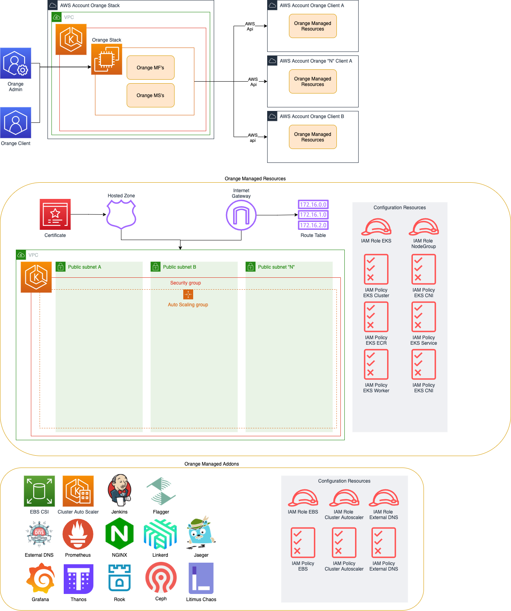

# Crossplane Infrastructure Helm Charts

## Requirements

 - [Kubectl](https://kubernetes.io/docs/tasks/tools/ "kubectl install page")
 - [Helm 3](https://helm.sh/docs/intro/install/ "Helm 3 install page")
 - [Minikube](https://minikube.sigs.k8s.io/docs/start/ "Minikube install page")
 - [AWS Account IAM User](https://docs.aws.amazon.com/IAM/latest/UserGuide/id_users_create.html "AWS IAM User Credentials file")
 - Domain with Hosted Zone on Route53

> **NOTE:**AWS User should have administrator access for demonstration pourposes 

## Base Configuration

Starts minikube and update context
```sh
# Starts minikube with default configuration
minikube start
# Set minikube to your current kubectl context
minikube update-context
```

Add necessary helm repositories
```sh
# Adding crossplane chart repository
helm repo add crossplane-stable https://charts.crossplane.io/stable
# Update chart repository index
helm repo update
# Create namespace for crossplane
kubectl create namespace crossplane-system
# Install crossplane with necessary provider enabled
helm upgrade --install crossplane \
    crossplane-stable/crossplane \
    -n crossplane-system \
    --version "1.6.1" \
    --set provider.packages="{crossplane/provider-aws:v0.22.0,crossplane/provider-helm:v0.9.0}"
```

Create a credentials file with your IAM User information:
```sh
[default]
aws_access_key_id=XXXXXXXXX
aws_secret_access_key=XXXXXXXXXXXXXXXXXXXXXXXXXXX
```
> Form more information [access here](https://docs.aws.amazon.com/cli/latest/userguide/cli-configure-files.html)

## Stacks

### AWS Simple Stack


Creating definied stack.
Replace the environment variables by the path of your previously create credentials file, desired [AWS Region](https://docs.aws.amazon.com/pt_br/AWSEC2/latest/UserGuide/using-regions-availability-zones.html#concepts-available-regions) and especific environment name.
```sh
# This command use local aws chart stack
helm upgrade --install $ENVIRONMENT_NAME ./charts/aws-k8s-stack \
    --set-file creds=$YOUR_CREDENTIALS_FILE_PATH \
    --set region=$REGION \
    --set fullnameOverride=$ENVIRONMENT_NAME \
    --set nameOverride=$ENVIRONMENT_NAME \
    --set route53.domain=$DOMAIN
```

Getting created resources:
```sh
# Install crossplane kubectl addon
curl -sL https://raw.githubusercontent.com/crossplane/crossplane/master/install.sh | sh
# Getting managed resources status
kubectl get managed
```

> To get managed resources in JSON format run "kubectl get managed -o json"

Deleting stack (only needed if you dont proceed to addons install):
```sh
helm delete $ENVIRONMENT_NAME
```

### AWS Addons Stack

After cluster creation, addons instalation are enabled.

 - [Cluster Autoscaler](https://github.com/kubernetes/autoscaler/tree/master/cluster-autoscaler) 
 - [EBS CSI Driver](https://github.com/kubernetes-sigs/aws-ebs-csi-driver) 
 - [External DNS](https://github.com/kubernetes-sigs/external-dns) 
 - [Ingress NGINX](https://github.com/kubernetes/ingress-nginx)

First get configuration and connection informations:
```sh
# Associate OIDC with cluster
eksctl utils associate-iam-oidc-provider --cluster $ENVIRONMENT_NAME --approve --region $REGION
# Get OIDC URL
OIDC_URL=$(aws eks describe-cluster --name $ENVIRONMENT_NAME --query "cluster.identity.oidc.issuer" --region $REGION --output text)
# Get account ID
ACCOUNT_ID=$(aws sts get-caller-identity --query Account --output text)
```

Install definied addons stack
```sh
# This command use local aws default addons chart
helm upgrade --install $ENVIRONMENT_NAME-addons ./charts/aws-default-addons \
    --set environmentName=$ENVIRONMENT_NAME \
    --set accountID=$ACCOUNT_ID \
    --set openIDConnectProviderURL=$OIDC_URL \
    --set region=$REGION \
    --set domain=$DOMAIN
```

Generated tools UI:
```sh
wordpress.$DOMAIN
jaeger.$DOMAIN
jenkins.$DOMAIN
kubernetes-dashboard.$DOMAIN
alertmanager.$DOMAIN
prometheus.$DOMAIN
grafana.$DOMAIN
litmus.$DOMAIN
ceph-dashboard.$DOMAIN
linkerd.$DOMAIN
```

For all generated tools these credentials for access
| Username | Password  |
| :------: | :-------: |
| admin    | admindemo |


Deleting stack and addons:
```sh
helm delete $ENVIRONMENT_NAME-addons
helm delete $ENVIRONMENT_NAME
```

## Next steps

- Do not use eksctl for OIDC association
- Remove aditional command lines between stack creation and addons configuration
- Improve tools configurations and capabilities
- Write charts NOTES.txt for install output
- Increase stacks avaliable